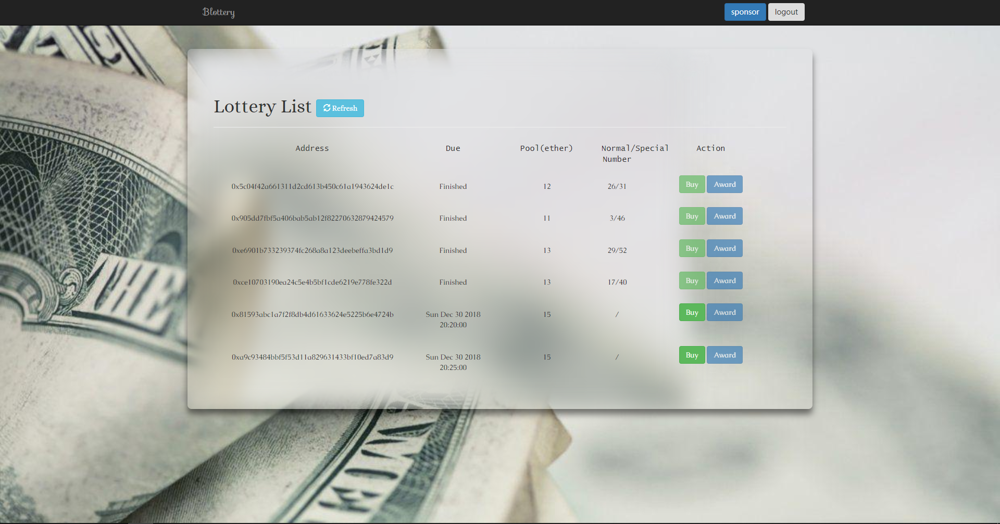

# Blottery

> a blochain-based lottery app

## start

require node, geth, truffle

`geth .\geth.exe -datadir <data> -networkid 5777 -rpc -rpcaddr '127.0.0.1' -rpccorsdomain "*" --port 9545 --rpcport 9545 --rpcapi="db,eth,net,web3,personal,web3" console 2> log.log`

In another terminal:

`npm i`

`truffle networks --clean`

`truffle migrate --reset`

`npm run dev`

may need turn off chrome cors security, such as:

`.\chrome.lnk --disable-web-security --user-data-dir=D:/blockchain`

open [127.0.0.1:8080](http://127.0.0.1:8080)

## Usage

- Because the app uses cdn js & css & fonts, so please ensure you can access: **cloudflare**, **jsdelivr**, **googleapis**.
- When you **buy** or **sponsor** or **award** a lottery, don't forget to **mine** in geth.
- Please don't refresh or close tab directly when you're logining in, **logout first**.
- Be patient and tolerant, thx 😁.

## Screenshot

